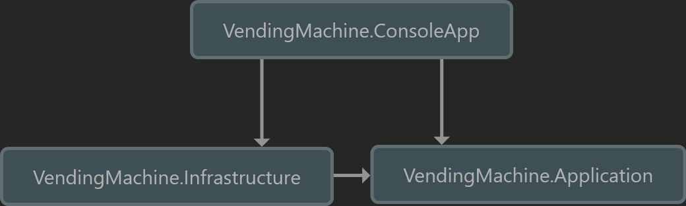

# Vending Machine

A .NET console application for a virtual vending machine. Implemented using the CQRS pattern with MediatR.

## Usage

If you have docker installed then in the root directory you can run the following command in the terminal: `docker compose run app`.

After the image has finished building the application will start in the same terminal.

Otherwise, run the `app.bat` script. It assumes you have all the platform dependencies installed.

## Architecture

The code is written following the clean architecture principles mentioned in this [blog post](https://jasontaylor.dev/clean-architecture-getting-started/).

### Improvements and Considerations

- Wallets are of type `Dictionary<CoinType, int>` but it would be better if it was a custom object

- Magic strings in `BuyProductHandler` should be in a separate `ErrorMessages` class

- Shouldly to make assertions easier to read in unit tests

- Missing documentation for classes and methods

- Some of the logic in ConsoleApp might be better off in the Application layer

- `WalletExtensions.GetAmountInCoins` can be improved for readability
