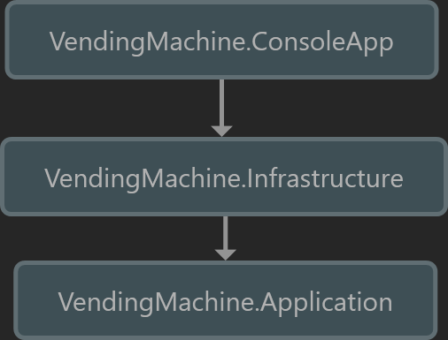

# Vending Machine

A .NET console application for a virtual vending machine. Implemented using the CQRS pattern with MediatR.

## Usage

If you have docker installed then in the root directory you can run the following command in the terminal: `docker compose run app`.

After the image has finished building the application will start in the same terminal.

Otherwise, run the `app.bat` script. It assumes you have all the platform dependencies installed.

## Architecture

The code is written following the clean architecture principles mentioned in this [blog post](https://jasontaylor.dev/clean-architecture-getting-started/).

